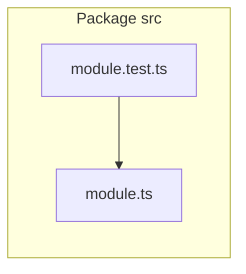

# 2. Co-locate TypeScript tests with source files

Date: 2026-03-22

## Status

Accepted

## Context

The monorepo used a mixed convention: [`CLAUDE.md`](../../CLAUDE.md) allowed tests either under per-package `tests/` or as siblings of source. Several tests in `packages/agent-chat-demo/tests/` sat outside `src/`, while root Vitest already only included `packages/*/src/**/*.{test,spec}.{ts,tsx}` ([`vitest.config.ts`](../../vitest.config.ts)), so the layout and discoverability story were easy to drift apart.

Goals:

- One clear rule for humans and agents ([`AGENTS.md`](../../AGENTS.md)).
- Tests live next to the module they primarily exercise, shortening imports and making refactors local.
- End-to-end tests that span modules either split into co-located files or live in the directory of the primary system under test; cross-cutting integration can import peer modules from tests only (e.g. orchestration tests that also exercise `concatenateAssistantText`).

## Decision

- Place `*.test.ts` and `*.test.tsx` as **sibling files** next to the primary implementation file under `packages/*/src/`.
- Do not add new tests under standalone `tests/` trees for package source.
- Keep Vitest’s include pattern scoped to `packages/*/src/**/*.{test,spec}.{ts,tsx}`.

## Consequences

### Positive

- Easier navigation: implementation and tests share a folder.
- Imports in tests use short relative paths (`./module` instead of `../src/...`).
- Vitest configuration and on-disk layout stay aligned.

### Negative / trade-offs

- Moving or renaming a source file should move or rename its test in the same change.
- Tests that naturally touch multiple layers may need splitting or a documented “primary” home (this repo moved a combined assistant-text + orchestration scenario into [`orchestration.test.ts`](../../packages/agent-chat-demo/src/shared/orchestration.test.ts) next to orchestration parsing).

### Mitigations

- Document the rule in `AGENTS.md` and `CLAUDE.md`.
- Run `pnpm test` in CI and before commits.
