# RFC 0001: DeepAgents Gemini Chat Demo Workspace

- **Status**: Proposed
- **Authors**: yu-iskw, ChatGPT
- **Created**: 2026-06-26
- **Target repository**: `yu-iskw/claude-agent-sdk-examples`
- **Target workspace**: `packages/deep-agent-chat-demo`
- **Related existing workspace**: `packages/agent-chat-demo`
- **Primary implementation language**: TypeScript
- **Runtime**: Node.js, pnpm workspace
- **Model providers required**:
  - Gemini API through Google AI / Google GenAI integration
  - Gemini on Vertex AI through Google Cloud Application Default Credentials or attached service account
- **Decision owner**: repository maintainer

---

## 1. Executive Summary

This RFC proposes adding a new TypeScript workspace, `packages/deep-agent-chat-demo`, that reimplements the current Claude Agent SDK chat demo using **DeepAgents JS** while preserving the existing web application contract as much as possible.

The existing `packages/agent-chat-demo` has a strong product shape:

1. React + Vite web UI.
2. Express backend.
3. `/api/chat` endpoint with `phase: "plan" | "execute"`.
4. Server-sent events for runtime activity.
5. A plan-before-execute approval gate.
6. Markdown-based project memory, agents, skills, rules, and MCP configuration.
7. An orchestration JSON block parsed into a UI-side plan checklist.
8. Workspace-scoped execution constraints.

The recommended solution is **not** to mutate the existing Claude demo. Instead, create a sibling package:

```text
packages/
  agent-chat-demo/          # current Claude Agent SDK implementation
  deep-agent-chat-demo/     # new DeepAgents + Gemini implementation
```

The new workspace should keep the existing UI and API contract stable, but replace the backend `runChat()` execution adapter with a DeepAgents-native runner.

The design uses two DeepAgents profiles:

1. **Plan profile**: no tools, no MCP, no subagent task delegation, no shell, no writes. It only returns prose plus the required orchestration JSON.
2. **Execute profile**: enabled only after explicit UI approval. It loads subagents, skills, MCP tools, read-only filesystem permissions, and model provider configuration.

The model layer must support two Google modes:

1. **Gemini API mode** for local experiments and lightweight demos.
2. **Vertex AI mode** for Google Cloud / enterprise deployment with ADC, attached service accounts, and IAM control.

The resulting application becomes a provider-neutral, open-source, Claude Code-like web demo built on DeepAgents, LangChain, LangGraph semantics, and Google Gemini models.

---

## 2. Intent & Issue Analysis

### 2.1 Stated Problem (X)

Create a comprehensive design RFC for a new DeepAgents TypeScript app that is as compatible as possible with the existing Claude Agent SDK `agent-chat-demo`, while supporting both Gemini API and Gemini on Vertex AI.

### 2.2 Underlying Intent (Y)

The real goal is to prove that this repository can host **multiple agent harness implementations** with comparable UX, governance, and workspace conventions:

- Claude Agent SDK implementation: `packages/agent-chat-demo`
- DeepAgents implementation: `packages/deep-agent-chat-demo`
- Future candidates: ADK, Mastra, Strands, OpenAI Agents SDK, etc.

This lets the repository become an experimental matrix for comparing agent SDKs under a shared product contract.

### 2.3 XY Problem Check

A literal one-to-one port from Claude Agent SDK to DeepAgents would be fragile because the two harnesses expose different runtime control planes.

Claude Agent SDK exposes concepts such as:

- `query()`
- `permissionMode: "plan" | "dontAsk"`
- `resume`
- SDK-specific system events
- Claude Code project settings
- `.claude` resource layout

DeepAgents exposes concepts such as:

- `createDeepAgent()`
- LangGraph-backed `invoke()` and `streamEvents()`
- `thread_id` / checkpointer-backed persistence
- subagents via a `task` tool
- skills via `SKILL.md`
- memory via `AGENTS.md`
- filesystem permissions
- optional sandbox backends
- LangChain model provider abstraction

Therefore the right design is a **compatibility adapter**, not a direct API clone.

### 2.4 Context & Impact

The current app is already structured in a way that makes this feasible:

- the UI talks only to `/api/chat`;
- shared types are SDK-neutral enough;
- orchestration parsing is UI-owned and model-output-driven;
- activity events are already normalized into app-owned event types;
- the server-side agent runner is the main Claude-specific seam.

The new app should preserve the product contract and replace only the execution harness.

---

## 3. References

### 3.1 Existing repository references

- Root package uses pnpm workspace scripts and Node engine constraints: `package.json`
- Workspace pattern is `packages/*`: `pnpm-workspace.yaml`
- Existing Claude app: `packages/agent-chat-demo`
- Existing API route: `packages/agent-chat-demo/src/server/http/apiRoutes.ts`
- Existing chat types: `packages/agent-chat-demo/src/shared/chat.ts`
- Existing activity types: `packages/agent-chat-demo/src/shared/activity.ts`
- Existing Claude runner: `packages/agent-chat-demo/src/agents/agent-runner.ts`
- Existing workspace memory: `packages/agent-chat-demo/CLAUDE.md`
- Existing MCP config: `packages/agent-chat-demo/.mcp.json`
- Existing markdown agents: `packages/agent-chat-demo/.claude/agents/*`
- Existing markdown skills: `packages/agent-chat-demo/.claude/skills/*/SKILL.md`

### 3.2 DeepAgents / LangChain references

- DeepAgents JS overview: https://docs.langchain.com/oss/javascript/deepagents/overview
- DeepAgents JS models: https://docs.langchain.com/oss/javascript/deepagents/models
- DeepAgents JS subagents: https://docs.langchain.com/oss/javascript/deepagents/subagents
- DeepAgents JS skills: https://docs.langchain.com/oss/javascript/deepagents/skills
- DeepAgents JS memory: https://docs.langchain.com/oss/javascript/deepagents/memory
- DeepAgents JS permissions: https://docs.langchain.com/oss/javascript/deepagents/permissions
- DeepAgents JS sandboxes: https://docs.langchain.com/oss/javascript/deepagents/sandboxes
- DeepAgents JS MCP: https://docs.langchain.com/oss/javascript/deepagents/mcp
- LangChain JS overview: https://docs.langchain.com/oss/javascript/langchain/overview

### 3.3 Google references

- Gemini API docs: https://ai.google.dev/gemini-api/docs
- Gemini API libraries: https://ai.google.dev/gemini-api/docs/libraries
- Gemini API key security: https://ai.google.dev/gemini-api/docs/api-key
- Google Cloud ADC: https://docs.cloud.google.com/docs/authentication/application-default-credentials
- Gemini Enterprise Agent Platform / models: https://docs.cloud.google.com/gemini-enterprise-agent-platform/models/start

---

## 4. Goals and Non-Goals

### 4.1 Goals

1. Add a new workspace under `packages/` named `deep-agent-chat-demo`.
2. Preserve the existing web-first UX:
   - chat panel;
   - workspace sidebar;
   - plan review card;
   - approval modal;
   - live runtime activity;
   - runtime trace;
   - structured orchestration checklist.
3. Preserve the API shape:
   - `GET /api/health`;
   - `POST /api/chat`;
   - JSON response mode;
   - SSE response mode.
4. Preserve the app-owned shared types where possible:
   - `ChatRequest`;
   - `ChatResponse`;
   - `ChatTrace`;
   - `ActivityEvent`;
   - `OrchestrationPlan`.
5. Implement DeepAgents as the backend harness.
6. Support Gemini API through a provider-neutral model factory.
7. Support Gemini on Vertex AI using ADC / attached service account semantics.
8. Keep credentials server-side only.
9. Create a provider-neutral workspace convention:
   - `AGENTS.md`;
   - `.agents/agents/*.md`;
   - `.agents/skills/*/SKILL.md`;
   - `.agents/rules/*.md`;
   - `.mcp.json`.
10. Preserve the plan-before-execute approval gate server-side, not only prompt-side.
11. Provide a secure baseline suitable for later deployment to Google Cloud.

### 4.2 Non-Goals

1. Do not remove or mutate `packages/agent-chat-demo`.
2. Do not implement production flight/hotel booking integrations in this RFC.
3. Do not expose Gemini API keys to the browser.
4. Do not require shell execution in the first milestone.
5. Do not attempt to exactly emulate every Claude SDK event type.
6. Do not make DeepAgents read `.claude/settings.json` directly.
7. Do not introduce A2A in the first implementation; design should leave room for it later.
8. Do not deploy to Google Cloud in the first pull request.

---

## 5. Decision Summary

### 5.1 Chosen Approach

Create a new package:

```text
packages/deep-agent-chat-demo
```

This package should copy or share most of the existing React client and shared protocol types, while replacing the backend runner with a DeepAgents implementation.

### 5.2 Why a New Package Instead of an In-Place Port?

| Option | Pros | Cons | Decision |
|---|---|---|---|
| Modify `agent-chat-demo` in place | Less duplication | Breaks working Claude demo; harder to compare SDKs | Reject |
| Add `deep-agent-chat-demo` sibling | Safe comparison; clear migration path; no existing UX breakage | Some duplicate UI/shared code initially | **Accept** |
| Extract shared UI library first | Elegant long-term structure | Bigger upfront refactor | Defer |
| Build CLI-only DeepAgents app | Easier backend | Does not satisfy web compatibility | Reject |

### 5.3 Architectural Thesis

The app contract should be SDK-independent:

```text
Browser UI  ->  App API Contract  ->  Agent Runner Adapter  ->  Agent Harness
```

The Claude and DeepAgents workspaces should differ only below the adapter seam.

---

## 6. High-Level System Context

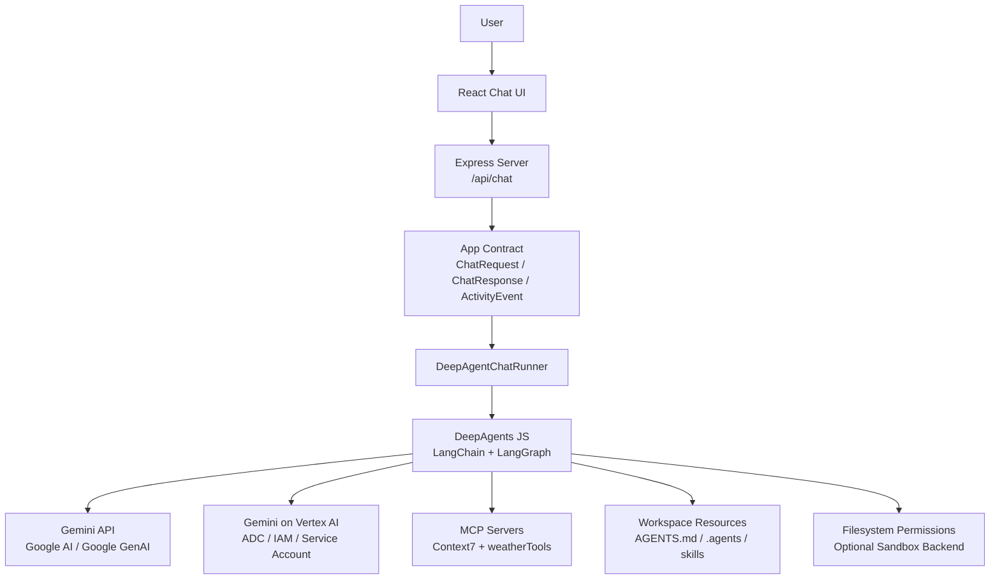

---

## 7. Repository and Workspace Layout

### 7.1 Current Workspace Assumption

The root repository is already a pnpm monorepo with packages discovered through `packages/*`.

### 7.2 Proposed Package Tree

```text
packages/
  agent-chat-demo/
    # Existing Claude Agent SDK implementation. Leave unchanged.

  deep-agent-chat-demo/
    package.json
    tsconfig.json
    tsconfig.server.json
    vite.config.ts
    index.html
    AGENTS.md
    .mcp.json
    .agents/
      settings.json
      agents/
        trip-planner.md
        flight-researcher.md
        hotel-researcher.md
        weather-forecaster.md
      skills/
        research-flight/
          SKILL.md
        research-hotel/
          SKILL.md
      rules/
        trip-planning.md
        safety.md
        model-provider.md
    src/
      client/
        # Initially copied from agent-chat-demo with labels changed.
      shared/
        activity.ts
        chat.ts
        orchestration.ts
        workspace.ts
      server/
        index.ts
        config.ts
        http/
          apiRoutes.ts
      agents/
        deepagent-runner.ts
        deepagent-config.ts
        deepagent-models.ts
        deepagent-profiles.ts
        deepagent-activity.ts
        deepagent-trace.ts
        deepagent-session.ts
        prompt.ts
        assistant-text.ts
        workspace-loader.ts
        mcp-loader.ts
        tools/
          weather-tool.ts
      tests/
        contract/
          api-chat-contract.test.ts
          orchestration-parser.test.ts
        agents/
          model-factory.test.ts
          plan-profile.test.ts
          execute-profile.test.ts
```

### 7.3 Workspace Boundary Diagram

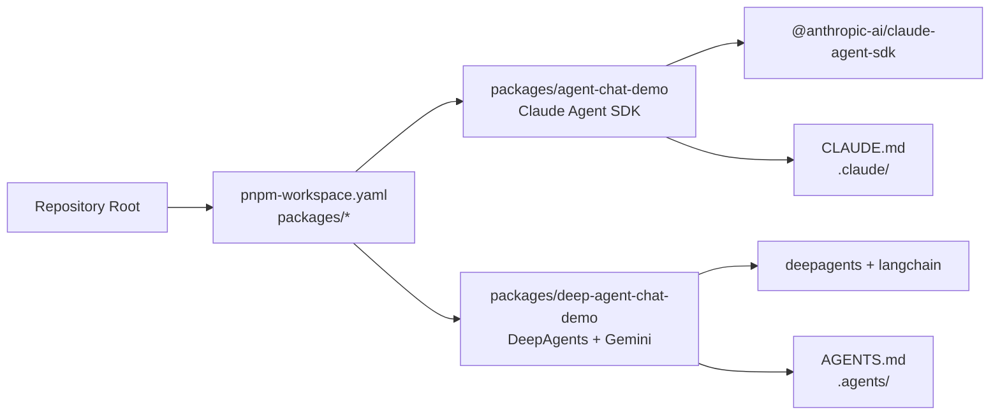

---

## 8. Compatibility Contract

### 8.1 HTTP Contract

The new app should keep the same public backend endpoints.

```text
GET  /api/health
POST /api/chat
```

`POST /api/chat` must keep:

- request body validation;
- `phase: "plan" | "execute"`;
- `sessionId` required for `execute`;
- JSON response for normal requests;
- SSE response when the client sends `Accept: text/event-stream`.

### 8.2 Chat Request Contract

```ts
export type ChatRequest = {
  phase: "plan" | "execute";
  sessionId?: string;
  message: string;
  history: ChatMessage[];
};
```

### 8.3 Chat Response Contract

```ts
export type ChatResponse = {
  reply: string;
  sessionId?: string;
  orchestration?: OrchestrationPlan | null;
  trace: ChatTrace;
};
```

### 8.4 SSE Contract

```text
data: { "type": "activity", "event": ActivityEvent }

data: { "type": "done", "response": ChatResponse }

data: { "type": "error", "error": string }
```

### 8.5 Compatibility Matrix

| Existing behavior | New DeepAgents behavior | Compatibility |
|---|---|---:|
| Plan phase first | Plan profile first | High |
| User approves plan | Same UI approval gate | High |
| Execute resumes session | Execute uses same `thread_id` as `sessionId` | High |
| Claude `permissionMode: plan` | DeepAgents no-tools/no-subagents profile | Medium |
| Claude `permissionMode: dontAsk` | DeepAgents execute-approved profile | Medium |
| Claude SDK events | DeepAgents stream projections mapped to app events | Medium |
| `.claude/agents` | `.agents/agents` loader | High |
| `.claude/skills` | `.agents/skills` loader | High |
| `CLAUDE.md` | `AGENTS.md` memory | High |
| `.mcp.json` | MCP loader via LangChain MCP adapter | High |
| Claude sandbox JSON | DeepAgents permissions + optional sandbox backend | Medium |

---

## 9. Runtime Architecture

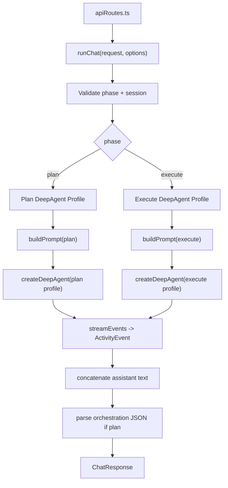

---

## 10. Plan / Execute State Machine

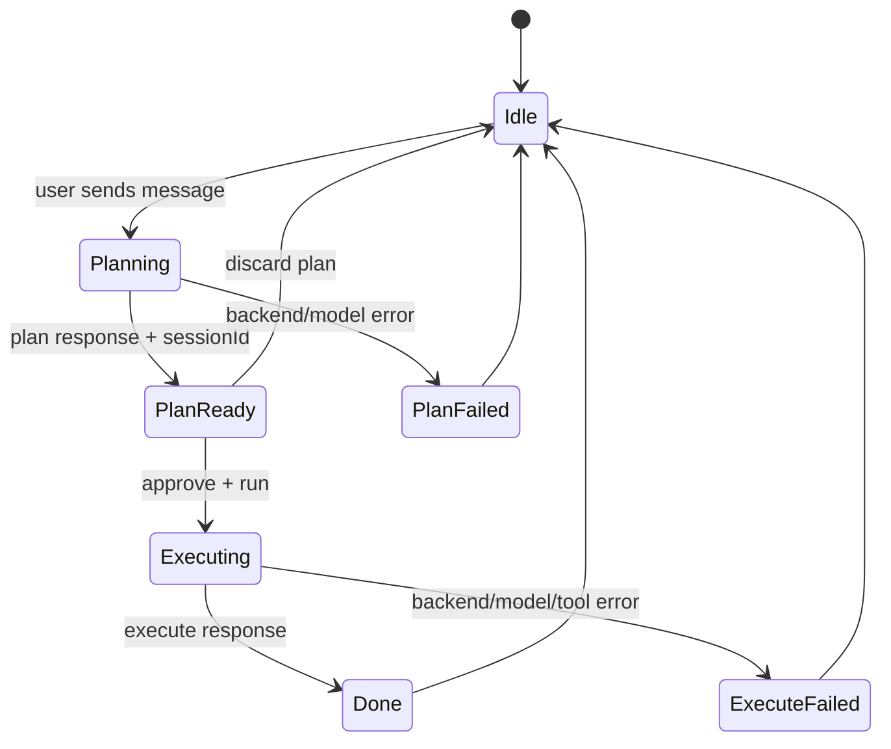

Server-side invariants:

1. `execute` requests must include a `sessionId` returned by a prior `plan` response.
2. The execute profile must not be reachable through prompt injection alone.
3. The server must select the profile based on `request.phase`, not based on model output.
4. The browser can render approval state, but the backend remains the source of truth for profile selection.

---

## 11. Plan Phase Design

### 11.1 Purpose

The plan phase reproduces Claude Agent SDK orchestration mode.

It must:

- parse the user request;
- explain assumptions;
- describe intended research;
- output exactly one valid orchestration JSON block;
- not run tools;
- not delegate to subagents;
- not access external MCP servers;
- not write files;
- return a `sessionId` that can be used by the execute phase.

### 11.2 Plan Profile

```text
Plan profile
  model: Gemini-compatible model
  tools: []
  subagents: []
  MCP: disabled
  filesystem visible tools: disabled or read-only metadata only
  sandbox: disabled
  permissions: deny write
  interrupt_on: not required because no tools are enabled
```

### 11.3 Plan Sequence

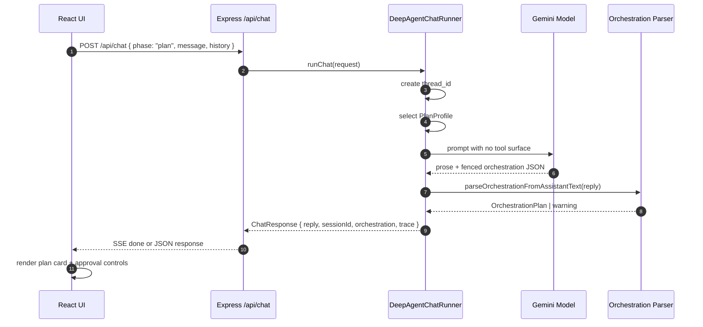

### 11.4 Required Orchestration Schema

Keep the existing schema unchanged:

```ts
export type OrchestrationPlan = {
  version: 1;
  title?: string;
  researchSteps: string[];
  nodes: OrchestrationNode[];
  edges: OrchestrationEdge[];
};
```

### 11.5 Plan Output Rules

The model must be instructed to end with exactly one fenced JSON block:

```json
{
  "version": 1,
  "title": "Trip research orchestration",
  "researchSteps": [
    "Normalize origin, destination, dates, budget, party size, and preferences.",
    "Delegate flight research to flight-researcher.",
    "Delegate lodging research to hotel-researcher.",
    "Delegate synthetic weather outlook to weather-forecaster.",
    "Synthesize recommendations into final sections after approval."
  ],
  "nodes": [
    { "id": "trip-planner", "kind": "agent", "name": "trip-planner" },
    { "id": "flight-researcher", "kind": "agent", "name": "flight-researcher" },
    { "id": "hotel-researcher", "kind": "agent", "name": "hotel-researcher" },
    { "id": "weather-forecaster", "kind": "agent", "name": "weather-forecaster" },
    { "id": "research-flight", "kind": "skill", "name": "research-flight" },
    { "id": "research-hotel", "kind": "skill", "name": "research-hotel" },
    { "id": "synthesis", "kind": "stage", "name": "compose_final_response" }
  ],
  "edges": [
    { "from": "trip-planner", "to": "flight-researcher", "label": "Task delegate after approval" },
    { "from": "trip-planner", "to": "hotel-researcher", "label": "Task delegate after approval" },
    { "from": "trip-planner", "to": "weather-forecaster", "label": "Task delegate after approval" },
    { "from": "flight-researcher", "to": "research-flight", "label": "uses skill" },
    { "from": "hotel-researcher", "to": "research-hotel", "label": "uses skill" },
    { "from": "flight-researcher", "to": "synthesis", "label": "flight results" },
    { "from": "hotel-researcher", "to": "synthesis", "label": "lodging results" },
    { "from": "weather-forecaster", "to": "synthesis", "label": "weather outlook" }
  ]
}
```

---

## 12. Execute Phase Design

### 12.1 Purpose

The execute phase runs only after explicit user approval.

It must:

- use the same `sessionId` / `thread_id` as the plan phase;
- enable the trip-planner agent;
- enable subagent delegation;
- load skills;
- enable approved MCP tools;
- call the weather tool;
- produce the final chat response;
- stream runtime activity to the UI;
- deny writes by default;
- avoid shell execution in the first milestone.

### 12.2 Execute Profile

```text
Execute profile
  model: Gemini-compatible model
  tools:
    - approved MCP tools
    - synthetic weather tool
    - optional safe web/doc fetch tools
  subagents:
    - flight-researcher
    - hotel-researcher
    - weather-forecaster
  skills:
    - research-flight
    - research-hotel
  memory:
    - AGENTS.md
  filesystem:
    - read allowed under package workspace
    - write denied by default
    - .env, credentials, node_modules, dist denied
  sandbox:
    - none in M1 unless shell is explicitly enabled
    - sandbox backend in M2+
  interrupt_on:
    - all expensive, write, shell, external-network, or non-demo tools
```

### 12.3 Execute Sequence

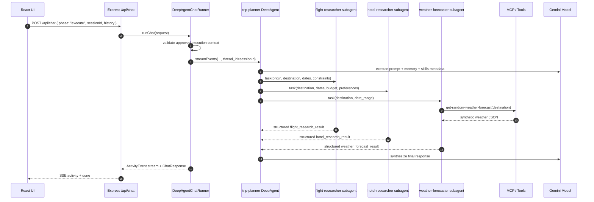

### 12.4 Final Response Contract

The execute response must include the following sections:

1. `Trip Plan`
2. `Flights`
3. `Lodging`
4. `Weather Forecast`
5. `Task Logs`
6. `Follow-up Questions`

The weather section must explicitly say that the weather tool is synthetic / randomized demo data.

---

## 13. DeepAgents Resource Model

### 13.1 Workspace Resource Mapping

| Claude demo resource | DeepAgents demo resource | Notes |
|---|---|---|
| `CLAUDE.md` | `AGENTS.md` | Loaded as always-on memory |
| `.claude/settings.json` | `.agents/settings.json` | App-owned config, not Claude-specific |
| `.claude/agents/*.md` | `.agents/agents/*.md` | Parsed into DeepAgents subagent specs |
| `.claude/skills/*/SKILL.md` | `.agents/skills/*/SKILL.md` | Loaded through DeepAgents skills |
| `.claude/rules/*.md` | `.agents/rules/*.md` | Concatenated into system prompt or memory |
| `.mcp.json` | `.mcp.json` | Reused as provider-neutral MCP config |

### 13.2 Resource Loading Diagram

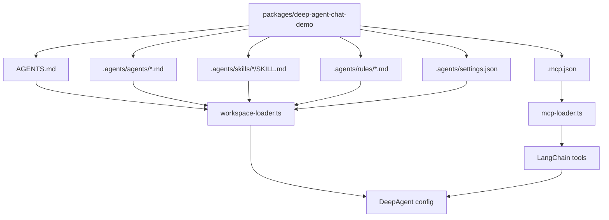

### 13.3 Markdown Agent Frontmatter

Each agent file should keep frontmatter close to the Claude demo, but interpreted by the DeepAgents loader.

```md
---
name: flight-researcher
description: Specialist agent that extracts flight needs and returns structured flight options.
tools:
  - read_file
  - grep
  - web_fetch
skills:
  - research-flight
model: inherit
---

# Flight Researcher Agent

...
```

### 13.4 Subagent Construction

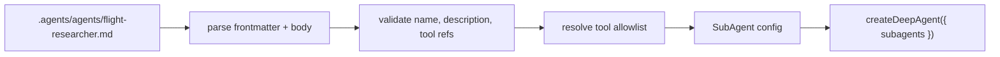

### 13.5 Skills Construction

DeepAgents skills should follow the `SKILL.md` directory pattern.

```text
.agents/skills/research-flight/SKILL.md
.agents/skills/research-hotel/SKILL.md
```

Skills are not eagerly pasted in full into every prompt. The loader should expose skill metadata and let DeepAgents load details on demand.

---

## 14. MCP Design

### 14.1 MCP Goals

The first milestone should support:

1. Context7 MCP server via `.mcp.json`.
2. A demo weather tool equivalent to the existing `weatherTools` behavior.
3. A policy layer around external tool calls.
4. Clear traceability of which MCP servers were loaded.

### 14.2 MCP Runtime Diagram

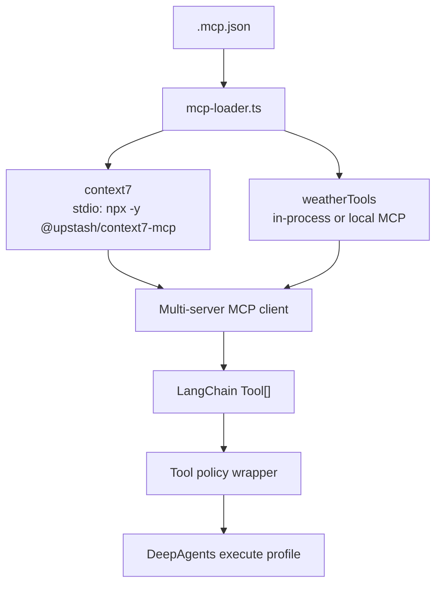

### 14.3 MCP Policy

Every MCP tool must be wrapped before being passed to DeepAgents.

Policy checks:

1. server name is allowlisted;
2. tool name is allowlisted for the current phase;
3. arguments pass Zod validation if schema is known;
4. network/cost risk is classified;
5. tool call is logged before execution;
6. output is size-capped;
7. output is redacted before being sent to model if needed.

### 14.4 MCP Phase Matrix

| MCP server | Plan phase | Execute phase | Notes |
|---|---:|---:|---|
| `context7` | Disabled by default | Enabled | Prevents plan phase from doing hidden research |
| `weatherTools` | Disabled | Enabled | Synthetic demo tool |
| future `flightSearch` | Disabled | HITL required | Expensive / external data |
| future `hotelSearch` | Disabled | HITL required | Expensive / external data |

---

## 15. Model Provider Design

### 15.1 Requirements

The app must support two Google execution modes:

| Mode | Target use | Auth | Example model config |
|---|---|---|---|
| `gemini-api` | local demo, simple hosted demo | `GEMINI_API_KEY` or `GOOGLE_API_KEY` | `google_genai:gemini-3.5-flash` |
| `vertex-ai` | Google Cloud enterprise deployment | ADC / attached service account | preconfigured Vertex AI chat model instance |

### 15.2 Model Factory

Create a single model factory:

```text
src/agents/deepagent-models.ts
```

Responsibilities:

1. read environment variables;
2. validate required fields;
3. create a LangChain-compatible chat model;
4. expose the selected model name in `ChatTrace.sessionModel`;
5. normalize safety, temperature, top-p, max-output, and reasoning parameters;
6. keep provider-specific code outside the runner.

### 15.3 Model Factory Diagram

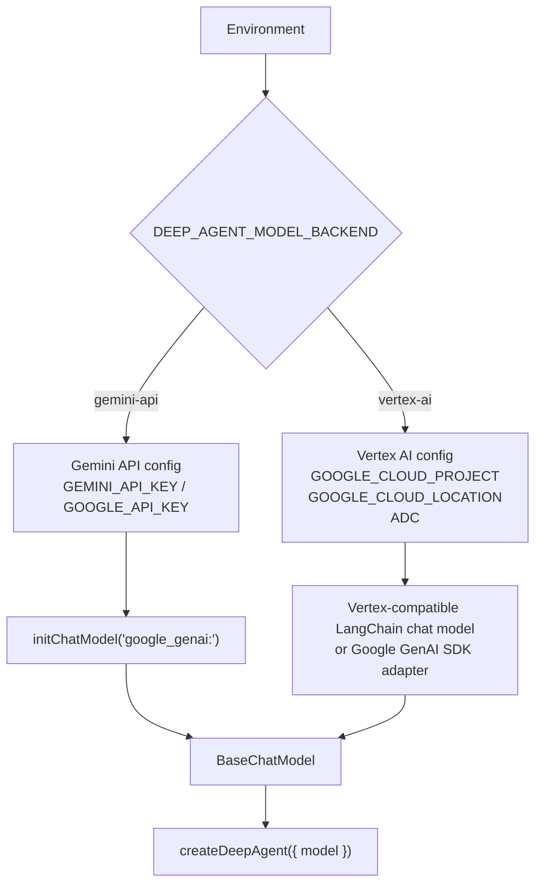

### 15.4 Environment Variables

```bash
# Common
DEEP_AGENT_MODEL_BACKEND=gemini-api # or vertex-ai
DEEP_AGENT_MODEL=gemini-3.5-flash
DEEP_AGENT_TEMPERATURE=0
DEEP_AGENT_MAX_OUTPUT_TOKENS=4096

# Gemini API mode
GEMINI_API_KEY=...
# GOOGLE_API_KEY is also accepted by Google client libraries.

# Vertex AI mode
GOOGLE_CLOUD_PROJECT=my-project
GOOGLE_CLOUD_LOCATION=us-central1
# Auth is via ADC, attached service account, or workload identity.

# Optional tracing
LANGSMITH_TRACING=true
LANGSMITH_API_KEY=...
```

### 15.5 Gemini API Mode

Recommended for:

- local development;
- simple examples;
- OSS contributor onboarding;
- CI smoke tests using a secret API key.

Security requirements:

1. API key must never be checked into source control.
2. API key must never be shipped to the browser.
3. API key must be read from server-side environment variables or a secret store.
4. API key should be restricted.
5. billing alerts should be enabled.
6. new keys should use auth-key semantics where possible.

### 15.6 Vertex AI Mode

Recommended for:

- Cloud Run deployment;
- GKE deployment;
- Cloud Workstations experiments;
- enterprise demos;
- IAM-governed usage;
- audit and billing integration.

Authentication requirements:

1. prefer attached service account in production;
2. grant least-privileged IAM roles;
3. use ADC discovery;
4. avoid service account key files;
5. use Workload Identity Federation if running outside Google Cloud;
6. expose selected project/location in trace but never expose credentials.

### 15.7 Model Provider Failover

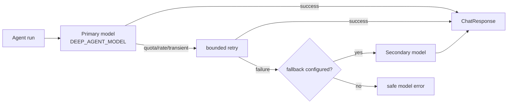

Failover must not silently switch data residency or billing contexts. If `vertex-ai` is selected, the fallback should remain in Vertex AI unless explicitly configured otherwise.

---

## 16. Session and Persistence Design

### 16.1 Session ID Mapping

The existing UI expects `sessionId` from the plan phase and sends it back in the execute phase.

DeepAgents should map this to a LangGraph-compatible thread identifier:

```text
ChatResponse.sessionId = thread_id
```

### 16.2 Session Lifecycle

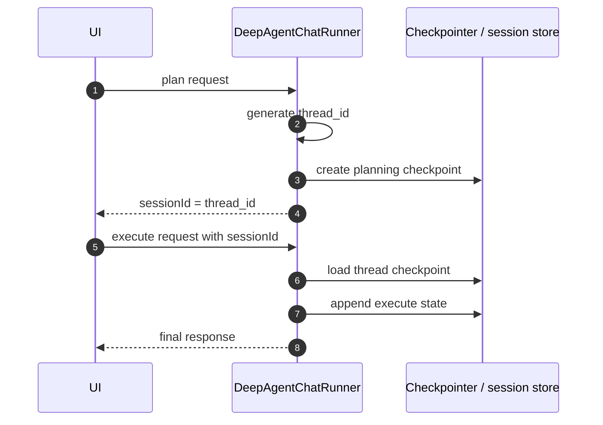

### 16.3 Storage Options

| Storage | Milestone | Pros | Cons |
|---|---:|---|---|
| In-memory map | M1 | simple | lost on restart |
| LangGraph memory checkpointer | M1/M2 | native semantics | may need adapter wiring |
| SQLite | M2 | durable local dev | extra dependency |
| Postgres / Cloud SQL | M3 | production durability | ops overhead |
| Firestore | M3 | GCP-native | schema/versioning design required |

M1 can use in-memory state, but the session adapter should expose an interface so storage can change later.

---

## 17. Streaming and Activity Mapping

### 17.1 Existing Activity Event Types

The app should preserve the existing `ActivityEvent` union:

- `session_init`
- `task_started`
- `task_progress`
- `task_completed`
- `tool_progress`
- `tool_use_summary`
- `status`

### 17.2 DeepAgents Stream Mapping

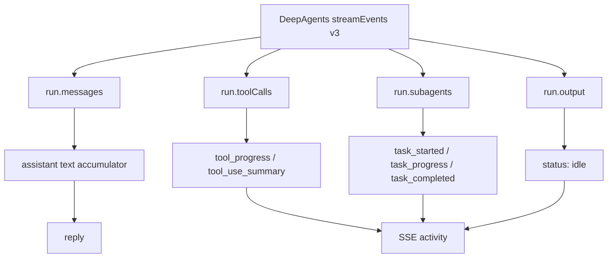

### 17.3 Event Mapping Table

| DeepAgents source | ActivityEvent | Notes |
|---|---|---|
| run start | `session_init` | synthetic event containing loaded agents, skills, tools, MCP servers, model |
| first subagent handle | `task_started` | taskId can be generated from subagent name + timestamp |
| subagent message chunk | `task_progress` | detail capped to avoid noisy UI |
| subagent output resolved | `task_completed` | status derived from success/error |
| tool call started | `tool_progress` | elapsed seconds updated periodically if possible |
| tool output resolved | `tool_use_summary` | output summarized / capped |
| model compaction/summarization | `status: compacting` | if observable; otherwise synthetic only |
| run done | `status: idle` | sent before `done` envelope |

### 17.4 Activity Privacy Rules

Never include the following in activity payloads:

- API keys;
- OAuth tokens;
- raw credential files;
- full MCP outputs containing secrets;
- complete prompts if they may contain private user data;
- full model responses beyond existing chat text.

---

## 18. Security and Governance Design

### 18.1 Threat Model

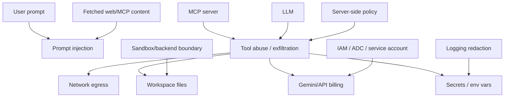

### 18.2 Security Layers

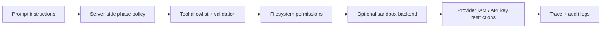

### 18.3 Baseline Policy

| Capability | Plan phase | Execute phase | Rationale |
|---|---:|---:|---|
| Model call | Yes | Yes | required |
| Subagents | No | Yes | only after approval |
| MCP tools | No | Yes | avoid hidden work in plan |
| Weather tool | No | Yes | execute-only demo tool |
| File read | No or minimal | workspace-only | prevent surprise leakage |
| File write | No | No by default | current trip demo says chat-only |
| Shell | No | No in M1 | reduce risk |
| Network fetch | No | restricted / HITL | prevent arbitrary egress |
| External paid APIs | No | HITL | cost control |

### 18.4 Filesystem Permission Design

Deny by default for writes. Allow reads only under the package workspace.

Example conceptual policy:

```text
allow read:  packages/deep-agent-chat-demo/**
deny  read:  **/.env*
deny  read:  **/*credential*
deny  read:  **/*token*
deny  read:  **/node_modules/**
deny  read:  **/dist/**
deny write: **
```

Important: DeepAgents filesystem permissions apply to built-in filesystem tools. Custom tools and MCP tools must be wrapped separately.

### 18.5 Credential Policy

| Secret | Allowed location | Browser exposure | Notes |
|---|---|---:|---|
| `GEMINI_API_KEY` | server env / secret manager | Never | Gemini API local/dev mode |
| `GOOGLE_API_KEY` | server env / secret manager | Never | accepted alternative env var |
| Vertex ADC | runtime environment | Never | prefer attached service account |
| LangSmith key | server env | Never | optional tracing |
| MCP server tokens | server env / secret manager | Never | only for approved MCP servers |

### 18.6 Google Cloud IAM Baseline for Vertex AI Mode

For production deployment on Google Cloud:

1. Run the backend on Cloud Run or GKE with an attached service account.
2. Grant the service account only the minimum role needed to call Gemini on Vertex AI.
3. Do not use user ADC in production.
4. Do not mount service account key files.
5. Use Secret Manager only for non-ADC secrets.
6. Use separate projects for dev/staging/prod.
7. Use billing alerts and quota controls.

### 18.7 Human-in-the-Loop

M1 uses app-level approval between plan and execute.

M2 should add tool-level HITL for:

- shell execution;
- file writes;
- external paid APIs;
- non-demo travel APIs;
- broad web fetches;
- MCP tools marked high risk.

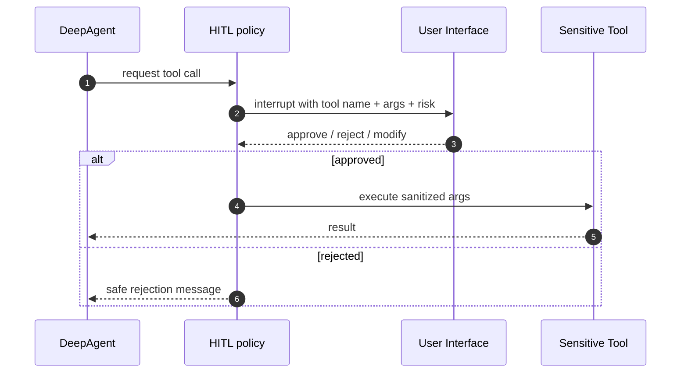

---

## 19. Google Gemini API and Vertex AI Compatibility

### 19.1 Compatibility Requirement

The implementation is not complete unless both of these smoke tests pass:

```bash
# Gemini API mode
DEEP_AGENT_MODEL_BACKEND=gemini-api \
DEEP_AGENT_MODEL=gemini-3.5-flash \
GEMINI_API_KEY=... \
pnpm --filter @typescript-template/deep-agent-chat-demo test

# Vertex AI mode
DEEP_AGENT_MODEL_BACKEND=vertex-ai \
DEEP_AGENT_MODEL=gemini-3.5-flash \
GOOGLE_CLOUD_PROJECT=... \
GOOGLE_CLOUD_LOCATION=us-central1 \
pnpm --filter @typescript-template/deep-agent-chat-demo test
```

### 19.2 Gemini API Request Path

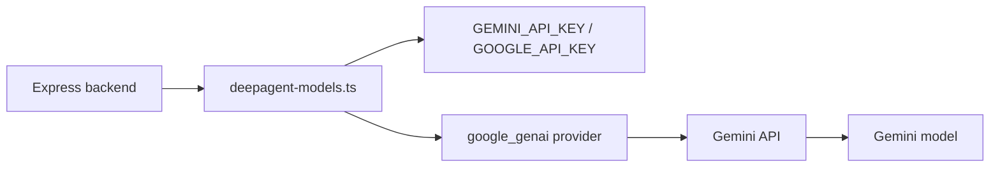

### 19.3 Vertex AI Request Path

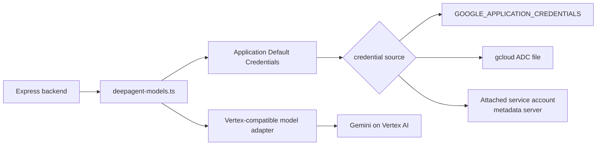

### 19.4 Vertex AI Auth Modes

| Environment | Credential strategy | RFC recommendation |
|---|---|---|
| Local dev | `gcloud auth application-default login` or service account impersonation | Acceptable for local only |
| Cloud Workstations | attached / impersonated service account | Preferred |
| Cloud Run | attached service account | Preferred production |
| GKE | Workload Identity | Preferred production |
| Non-GCP CI | Workload Identity Federation | Preferred over key files |
| Service account key file | `GOOGLE_APPLICATION_CREDENTIALS` | Avoid unless no alternative |

### 19.5 Model Abstraction

The runner must accept a `BaseChatModel`-like object from the factory and must not know whether it is backed by Gemini API or Vertex AI.

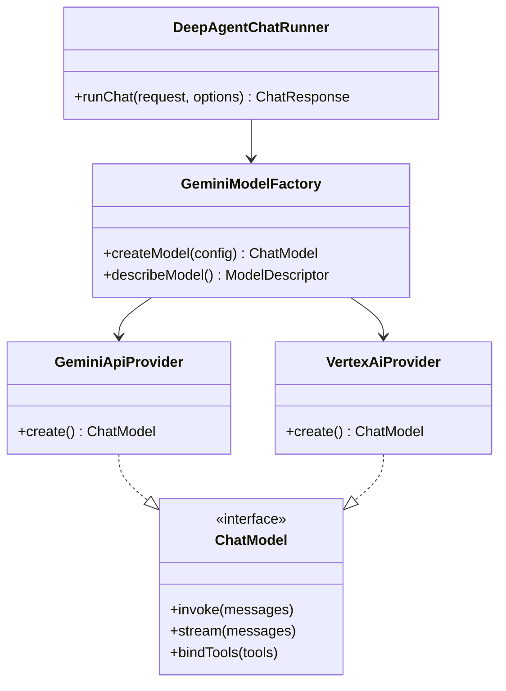

---

## 20. Application Components

### 20.1 Backend Component Diagram

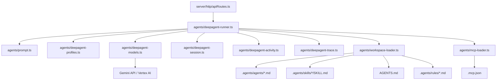

### 20.2 Frontend Reuse

Initial implementation should copy the existing frontend and change labels only:

| Existing label | New label |
|---|---|
| Claude Agent SDK Demo | DeepAgents Gemini Demo |
| Claude | DeepAgent |
| SDK orchestration mode | DeepAgents plan profile |
| SDK activity | DeepAgents activity |
| Claude Code settings | AGENTS.md / .agents settings |

Do not rewrite the UX in the first implementation.

---

## 21. Proposed Package Dependencies

### 21.1 Runtime Dependencies

```json
{
  "dependencies": {
    "deepagents": "^1.10.5",
    "langchain": "^1.5.0",
    "@langchain/core": "^1.2.0",
    "@langchain/langgraph": "^1.4.4",
    "@langchain/langgraph-checkpoint": "^1.1.2",
    "@langchain/langgraph-sdk": "^1.9.23",
    "@langchain/mcp-adapters": "latest",
    "@google/genai": "latest",
    "cors": "^2.8.6",
    "express": "^5.2.1",
    "react": "^19.2.4",
    "react-dom": "^19.2.4",
    "react-markdown": "^10.1.0",
    "remark-breaks": "^4.0.0",
    "remark-gfm": "^4.0.1",
    "zod": "^4.3.6",
    "yaml": "^2.8.2"
  }
}
```

Notes:

1. Version pins should be adjusted at implementation time to match repository policy.
2. `deepagents` has LangChain runtime packages as peer dependencies; keep a single version tree.
3. `@google/genai` is included because Google recommends the Google GenAI SDK for Gemini API work and it gives a fallback path for Vertex-compatible adapters.
4. If LangChain exposes a stable Vertex AI chat package in the selected version, prefer that package over custom adapter work.

---

## 22. Trace Design

### 22.1 Existing Trace Fields

Keep the existing trace shape, but reinterpret values through DeepAgents.

| Field | DeepAgents value |
|---|---|
| `workspace` | package root |
| `sandboxed` | true only when sandbox backend is enabled |
| `loadedProjectConfig` | true if `AGENTS.md`, `.agents`, `.mcp.json` loaded |
| `activeAgent` | `trip-planner` |
| `mcpServers` | names from `.mcp.json` and built-ins |
| `phase` | request phase |
| `parseWarning` | orchestration parser warning |
| `availableAgents` | parsed subagent names |
| `availableSkills` | parsed skill names |
| `sessionModel` | selected Gemini model descriptor |
| `sessionPermissionMode` | `deepagents-plan` or `deepagents-execute-approved` |

### 22.2 Trace Flow

```mermaid
flowchart LR
  WorkspaceLoader["workspace-loader"] --> TraceBuilder["deepagent-trace.ts"]
  ModelFactory["model factory"] --> TraceBuilder
  McpLoader["mcp-loader"] --> TraceBuilder
  Profile["selected profile"] --> TraceBuilder
  Parser["orchestration parser"] --> TraceBuilder
  TraceBuilder --> ChatTrace["ChatTrace"]
  ChatTrace --> UI["Runtime trace panel"]
```

---

## 23. Error Handling

### 23.1 Error Categories

| Category | Example | HTTP/SSE behavior |
|---|---|---|
| Bad request | missing message/history | 400 JSON error |
| Invalid phase | not `plan` or `execute` | 400 JSON error |
| Missing session | execute without sessionId | 400 JSON error |
| Config error | no model backend env | SSE error / 500 JSON |
| Auth error | invalid API key / ADC failure | safe error message |
| Model error | provider exception | safe error message |
| Tool policy denial | blocked MCP/tool call | model-visible denial + activity event |
| Orchestration parse warning | invalid JSON fence | 200 response with warning |

### 23.2 Error Boundary Diagram

```mermaid
flowchart TB
  Request["/api/chat"] --> Validate["request validation"]
  Validate -->|invalid| Http400["400"]
  Validate --> Runner["runChat"]
  Runner --> Config["config/model/session loading"]
  Config -->|error| Safe500["safe 500 or SSE error"]
  Config --> Agent["DeepAgent run"]
  Agent -->|tool denied| Denial["tool denial activity + model result"]
  Agent -->|provider error| ProviderError["safe provider error"]
  Agent -->|success| Parse["orchestration parser"]
  Parse -->|warning| WarnResponse["200 with parseWarning"]
  Parse -->|ok| Done["200 done"]
```

---

## 24. Testing Strategy

### 24.1 Contract Tests

| Test | Purpose |
|---|---|
| `GET /api/health` | server boots |
| plan request JSON | plan returns `reply`, `sessionId`, `trace` |
| plan request SSE | emits `activity` and `done` envelopes |
| execute without session | rejected |
| execute with session | returns final response |
| invalid orchestration | returns parse warning, not crash |

### 24.2 Workspace Loader Tests

| Test | Purpose |
|---|---|
| loads `AGENTS.md` | memory discovered |
| loads `.agents/agents/*.md` | subagents discovered |
| loads `.agents/skills/*/SKILL.md` | skills discovered |
| rejects duplicate agent names | deterministic config |
| rejects unsafe tool refs | policy enforcement |
| loads `.mcp.json` | MCP server names reported |

### 24.3 Model Factory Tests

| Test | Required env | Expected |
|---|---|---|
| Gemini API config validation | `GEMINI_API_KEY` | model descriptor returned |
| Gemini API missing key | none | config error |
| Vertex config validation | `GOOGLE_CLOUD_PROJECT`, `GOOGLE_CLOUD_LOCATION` | model descriptor returned |
| Vertex missing project | missing project | config error |
| model descriptor trace | any mode | provider/model/backend included |

### 24.4 Integration Smoke Tests

```mermaid
flowchart LR
  Test["pnpm test"] --> Contract["contract tests"]
  Test --> Loader["workspace loader tests"]
  Test --> ModelFactory["model factory tests"]
  Test --> Plan["plan profile smoke"]
  Test --> Execute["execute profile smoke"]

  Plan --> GeminiApi["Gemini API mode"]
  Plan --> Vertex["Vertex AI mode"]
  Execute --> GeminiApi
  Execute --> Vertex
```

### 24.5 Golden Prompt

Reuse the existing multi-city trip prompt from the Claude demo as the golden prompt for cross-SDK comparison.

Validation checks:

1. plan output contains valid orchestration JSON;
2. plan graph includes required agents/skills/stage nodes;
3. execute output includes all required sections;
4. weather output mentions synthetic/demo status;
5. no files are written;
6. activity log includes subagent and tool events;
7. trace lists selected model provider and MCP servers.

---

## 25. Migration Plan

### 25.1 Milestone 0: RFC Acceptance

Deliverables:

- this RFC committed;
- decision on package name;
- decision on M1 model defaults;
- decision on whether to copy or share client/shared code.

### 25.2 Milestone 1: Minimal DeepAgents Workspace

Deliverables:

1. `packages/deep-agent-chat-demo/package.json`
2. copied client/shared/server scaffolding;
3. `AGENTS.md` and `.agents` resources copied from `.claude` equivalents;
4. basic Gemini API model factory;
5. plan profile;
6. execute profile with subagents and synthetic weather tool;
7. current UI works end-to-end.

Exit criteria:

- `pnpm --filter @typescript-template/deep-agent-chat-demo build` passes;
- `pnpm --filter @typescript-template/deep-agent-chat-demo test` passes;
- local Gemini API run works with `GEMINI_API_KEY`.

### 25.3 Milestone 2: Vertex AI Mode

Deliverables:

1. Vertex AI model provider path;
2. ADC-based auth validation;
3. Cloud Run compatible env config;
4. no service account key dependency;
5. smoke test using impersonated or attached service account.

Exit criteria:

- local ADC or Cloud Workstations run succeeds;
- Cloud Run-style config documented;
- trace shows backend `vertex-ai` and project/location without secrets.

### 25.4 Milestone 3: MCP and Policy Hardening

Deliverables:

1. Context7 MCP integration;
2. MCP tool policy wrapper;
3. server-side allowlist;
4. output redaction and size caps;
5. HITL interrupt design for high-risk tools.

### 25.5 Milestone 4: Production Hardening

Deliverables:

1. durable session storage;
2. structured audit logs;
3. Cloud Run deployment guide;
4. Secret Manager integration;
5. regression tests for prompt injection and tool exfiltration;
6. optional LangSmith tracing config.

---

## 26. Comparison with Existing Claude Demo

| Capability | Claude demo | DeepAgents demo target |
|---|---|---|
| Web UI | React/Vite | same initially |
| Backend | Express | same |
| Agent harness | Claude Agent SDK | DeepAgents JS |
| Model | Claude alias `haiku` | Gemini API / Vertex AI |
| Plan mode | Claude `permissionMode: plan` | no-tools/no-subagents plan profile |
| Execute mode | Claude `permissionMode: dontAsk` | execute-approved profile |
| Resume | Claude `resume` | LangGraph `thread_id` |
| Agents | `.claude/agents` | `.agents/agents` |
| Skills | `.claude/skills` | `.agents/skills` |
| Memory | `CLAUDE.md` | `AGENTS.md` |
| MCP | `.mcp.json` passed to SDK | `.mcp.json` loaded via MCP adapter |
| Sandbox | Claude SDK sandbox option | filesystem permissions + optional sandbox backend |
| Event stream | Claude SDK messages | DeepAgents stream projections |
| Trace | Claude init extras | synthetic DeepAgents trace |

---

## 27. Open Questions

1. Should the UI/shared code be copied into the new package first, then extracted later, or should we immediately create a shared workspace such as `packages/agent-chat-ui`?
2. Should `.agents/settings.json` have a formal schema from the first implementation?
3. Should Context7 be enabled in the plan phase for documentation-only questions, or disabled for strict plan purity?
4. Should the first execute profile permit web fetches, or rely only on heuristic fallback plus weather demo tool?
5. Which Vertex AI region should be the documented default: `us-central1`, `global`, or user-provided only?
6. Should LangSmith tracing be enabled by default in development, or only when env vars are present?
7. Should the weather tool be implemented as a LangChain tool first and MCP server later, or as an MCP server immediately?
8. Should the package name use `deep-agent-chat-demo` or `deepagents-chat-demo`?

---

## 28. Recommended Answers to Open Questions

| Question | Recommendation |
|---|---|
| Copy vs shared UI | Copy first, extract later after both demos stabilize |
| Settings schema | Yes, use Zod from M1 |
| Context7 in plan phase | Disabled by default |
| Web fetches in M1 | Disable live web; use heuristic fallback + Context7 only after approval |
| Vertex region default | Require explicit `GOOGLE_CLOUD_LOCATION`; examples may use `us-central1` |
| LangSmith default | Off unless env vars are present |
| Weather tool shape | LangChain tool in M1; MCP server in M2 |
| Package name | `deep-agent-chat-demo` for readability |

---

## 29. Implementation Checklist

### 29.1 File Creation

- [ ] Create `packages/deep-agent-chat-demo`.
- [ ] Add package-specific `package.json`.
- [ ] Copy Vite/React/Express scaffold.
- [ ] Copy shared chat/activity/orchestration types.
- [ ] Add `AGENTS.md`.
- [ ] Add `.agents/agents/*.md`.
- [ ] Add `.agents/skills/*/SKILL.md`.
- [ ] Add `.agents/rules/*.md`.
- [ ] Add `.mcp.json`.

### 29.2 Backend

- [ ] Implement `deepagent-runner.ts`.
- [ ] Implement `deepagent-models.ts`.
- [ ] Implement `deepagent-profiles.ts`.
- [ ] Implement `deepagent-session.ts`.
- [ ] Implement `deepagent-activity.ts`.
- [ ] Implement `deepagent-trace.ts`.
- [ ] Implement `workspace-loader.ts`.
- [ ] Implement `mcp-loader.ts`.
- [ ] Implement synthetic weather tool.

### 29.3 Security

- [ ] No browser-visible API keys.
- [ ] `.env*` ignored and denied to agents.
- [ ] Write operations denied by default.
- [ ] MCP allowlist enforced.
- [ ] Tool outputs capped.
- [ ] Activity logs redacted.
- [ ] Vertex AI mode uses ADC.

### 29.4 Tests

- [ ] Contract tests.
- [ ] Orchestration parser tests.
- [ ] Workspace loader tests.
- [ ] Model factory tests.
- [ ] Plan profile tests.
- [ ] Execute profile tests.
- [ ] Gemini API smoke test.
- [ ] Vertex AI smoke test.

---

## 30. Future Extensions

### 30.1 A2A / Remote Agent Support

After the DeepAgents workspace is stable, the trip planner can be exposed through A2A or an app-specific remote-agent API.

```mermaid
flowchart LR
  Slack["Slack App"] --> Gateway["Agent Gateway"]
  Web["Web UI"] --> Gateway
  Cursor["Cursor / IDE"] --> Gateway
  Gateway --> A2A["A2A Endpoint"]
  A2A --> DeepAgent["DeepAgents Trip Planner"]
  DeepAgent --> MCP["MCP tools"]
  DeepAgent --> Gemini["Gemini / Vertex AI"]
```

### 30.2 Shared Agent Demo Contract

Create a future package:

```text
packages/agent-chat-contract
```

It would own:

- `ChatRequest`;
- `ChatResponse`;
- `ActivityEvent`;
- `OrchestrationPlan`;
- SSE helpers;
- plan transform utilities;
- golden prompt fixtures.

Then both Claude and DeepAgents demos can import the same contract.

### 30.3 Google Cloud Deployment

```mermaid
flowchart TB
  User["Browser"] --> LB["HTTPS Load Balancer / Cloud Run URL"]
  LB --> CloudRun["Cloud Run service<br/>deep-agent-chat-demo"]
  CloudRun --> Vertex["Vertex AI Gemini"]
  CloudRun --> SecretManager["Secret Manager<br/>optional non-ADC secrets"]
  CloudRun --> Logging["Cloud Logging"]
  CloudRun --> Trace["Cloud Trace / LangSmith"]
  CloudRun --> Artifact["Artifact Registry image"]
  CloudRun --> ServiceAccount["Attached service account"]
  ServiceAccount --> IAM["Least-privilege IAM"]
```

### 30.4 Secure Coding Agent Variant

The same design can later support coding-agent style tasks by enabling sandbox backends and shell execution under stricter HITL.

```mermaid
flowchart LR
  DeepAgent["DeepAgent"] --> Sandbox["Sandbox backend"]
  Sandbox --> Execute["execute tool"]
  Execute --> Tests["pnpm test / build"]
  Execute --> Files["workspace files"]
  Policy["HITL + filesystem permissions"] --> Execute
```

---

## 31. Final Recommendation

Implement `packages/deep-agent-chat-demo` as a sibling workspace to the existing Claude demo.

Use this layered design:

1. Keep the web UI contract stable.
2. Replace only the server-side runner seam.
3. Use DeepAgents plan and execute profiles to emulate Claude plan/execute semantics.
4. Use `AGENTS.md`, `.agents/agents`, `.agents/skills`, and `.mcp.json` as provider-neutral workspace conventions.
5. Implement a Google model factory with both Gemini API and Vertex AI modes.
6. Keep credentials server-side, use ADC for Vertex AI, and avoid service account keys in production.
7. Deny writes and shell execution in M1.
8. Add MCP and HITL policy hardening in M2+.

This gives the repository a clean, testable, extensible foundation for comparing Claude Agent SDK and DeepAgents with the same trip-planning UX, while making Gemini and Google Cloud first-class targets.
